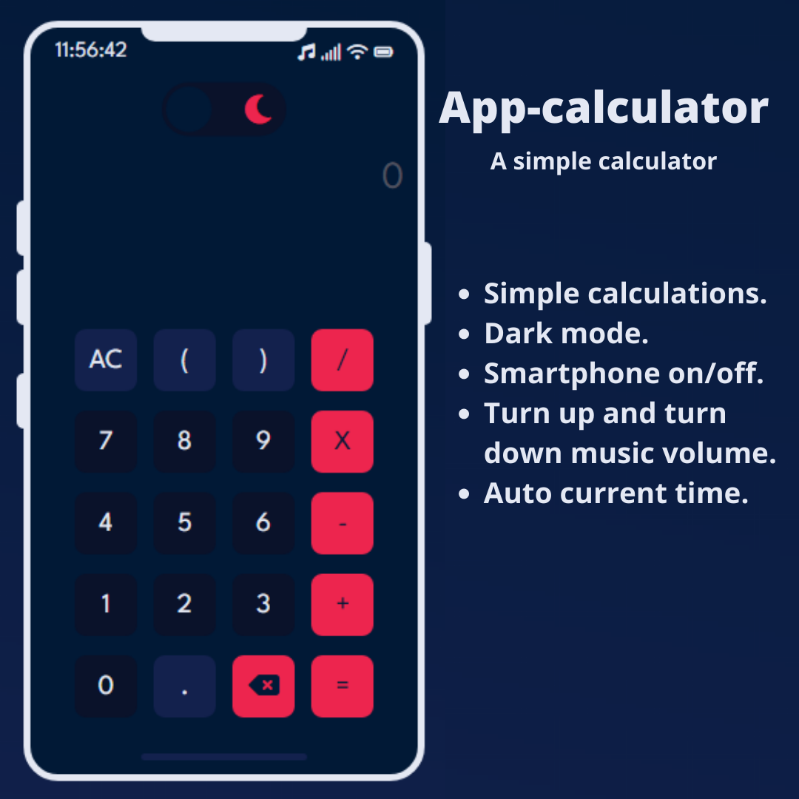

# app-calculator


<div align="center">

### shortcuts 😉

| 1º | 2º | 3º | 4º | 5º |
|----|----|----|----|----|
| [Calculator](#calc) | [Theme☀️🌙](#theme) | [on/off](#onOff) | [Volume](#volume) | [Time](#time) |

</div>

<br>
<br>

|       Light mode☀️         |           Dark mode 🌙   |
|:--------------------------:|:-------------------------:|
|  |  |

<div id="calc">

# how was the calculation done?
  
</div>

### Constructor Function

```js
function Calculator() {
  // Constructor Function
}

const calc = new Calculator();
calc.init();

```
* `function Calculator()` is a constructor function that serves as a template for creating new objects and the part of the variable called `calc` is instantiated. Within this function you will have the following resources:
<hr/>

### Variables and Functions

> #### `this.input` and `this.display`
```js
this.input = document.getElementById('input');
this.display = document.getElementById('display');
```
* `this.input` It is the input that will have the values that will be calculated.
* `this.display` This is where the calculation result will be displayed.
<hr/>

> #### `this.init()`
```js
this.init = () => {
  this.checkChar();
  this.buttonClick();
  this.pressEnter();
  this.buttonPress();
}
```
* `this.init` It is a `arrow function` to perform the main functions.
<hr/>

> #### `this.errorMessage()`
```js
this.errorMessage = (msg) => {
  this.input.value = this.input.value.replace('*', 'X');
  this.input.classList.add('errorMessage');
  this.display.classList.add('errorMessage');
  this.display.innerText = msg;
}
```
* `this.errorMessage()` It serves to show messages of possible errors, this function receives a parameter called `msg` which is the text of the message.

<hr/>

> #### `this.checkChar()`
```js
this.checkChar = () => {
  if (this.input.value === '') this.input.value = 0;
  this.input.addEventListener('keyup', e => {
    this.cleanInput();
    this.errorMessage("you can't type here 😃.");
  });
}
```
* `this.checkChar()` The input is disabled, but if the user tries to enable and type something automatically, the input will be cleared and call the `this.errorMessage` function with an error message. This function adds a `click` event.

<hr/>

> #### `this.calc()`
```js
this.calc = () => {
  try {
    this.input.value = this.input.value.replace('X', '*');
    const inputValue = eval(this.input.value);
    this.input.value = this.input.value.replace('*', 'X');

    if (!inputValue) {
      this.errorMessage('Formatting error');
      return
    }
    this.display.innerText = inputValue;
  } catch (error) {
    this.errorMessage('Formatting error');
    return;
  }
}
```
* `this.calc` inside this function i am using `try/catch` instruction to calculate and if not, it shows an error. and this `this.calc` function takes all the values of `this.input` and calls a `eval()` method to calculate it. this method is quite dangerous, as in addition to calculating it executes Javascript code, for example `alert('test')` , so I disabled text input.

<hr/>

> #### *this.setValueInput()*
```js
this.setValueInput = (el) => {
    if (this.input.value == 0) this.input.value = '';
    this.input.value += el;
    this.input.focus();
  }
```
* `this.setValueInput` is a function that will receive a value that can be a number or a string, and that value will be added to the input.

<hr/>

> #### `this.cleanInput()`
```js
this.cleanInput = () => {
  this.input.value = 0;
  this.display.innerText = '';
}
```
* `this.cleanInput` this function will clear the input when called.

<hr/>

> #### `this.deleteOne()`
```js
this.deleteOne = () => this.input.value = this.input.value.slice(0, -1);
```
* `this.deleteOne` is a function that erases a value from the input using the `slice()` method

> #### `this.ButtonClick()`
```js
this.buttonClick = () => {
  document.addEventListener('click', e => {
    const el = e.target;
    if (el.classList.contains('btn-num')) this.setValueInput(el.innerText);
    if (el.classList.contains('btn-others')) this.setValueInput(el.innerText);
    if (el.classList.contains('btn-operator')) this.setValueInput(el.innerText);
    if (el.classList.contains('btn-clean')) this.cleanInput();
    if (el.classList.contains('btn-del')) this.deleteOne();
    if (this.display.innerText === 'Formatting error') this.display.innerText = '';
    this.input.classList.remove('errorMessage');
    this.display.classList.remove('errorMessage');
    if (el.classList.contains('btn-equal')) this.calc();
    if (this.input.value === '') this.input.value = 0;
  });
}
```
* `this.ButtonClick` This function takes the value of each button and sends it to the `this.setValueInput(value)` function.

<hr/>

> #### `this.pressEnter`
```js
this.pressEnter = () => {
  document.addEventListener('keydown', e => {
    if (e.keyCode === 13) return this.calc();
  })
}
```
* `this.pressEnter` this function adds a click event to perform the calculation when the enter key is pressed.

> #### `this.buttonPress()`
```js
this.buttonPress = () => {
  document.addEventListener('keydown', e => {
    const keyCode = e.keyCode;
    if (keyCode === 96 || keyCode === 48) this.setValueInput(0);
    if (keyCode === 97 || keyCode === 49) this.setValueInput(1);
    if (keyCode === 98 || keyCode === 50) this.setValueInput(2);
    if (keyCode === 99 || keyCode === 51) this.setValueInput(3);
    if (keyCode === 100 || keyCode === 52) this.setValueInput(4);
    if (keyCode === 101 || keyCode === 53) this.setValueInput(5);
    if (keyCode === 102 || keyCode === 54) this.setValueInput(6);
    if (keyCode === 103 || keyCode === 55) this.setValueInput(7);
    if (keyCode === 104 || keyCode === 56) this.setValueInput(8);
    if (keyCode === 105 || keyCode === 57) this.setValueInput(9);
    if (keyCode === 8) this.deleteOne();
    if (keyCode === 46) this.cleanInput();
    if (keyCode === 107) this.setValueInput('+');
    if (keyCode === 109) this.setValueInput('-');
    if (keyCode === 106) this.setValueInput('*');
    if (keyCode === 111) this.setValueInput('/');
    if (keyCode === 194) this.setValueInput('.');
    if (this.display.innerText === 'Formatting error') this.display.innerText = '';
    if (this.input.value === '') this.input.value = 0;
    this.input.classList.remove('errorMessage');
    this.display.classList.remove('errorMessage');
  });
}
```
* `this.buttonPress` this function adds a `keydown` event to take the key the user has typed and checks if it is a number, operator or dot and sends that value to `this.setValueInput()`.
 
<hr/>
  
<div id="theme">
  
## Change theme. 
  
</div>
  
* Firstly in our html we have an `input` tag of type `checkbox` and a `label` and inside this label there are icons and a div. Follow the html code.
  
```html
<input type="checkbox" id="checkbox" />
<label for="checkbox" class="label">
  <i class="fas fa-sun"></i>
  <i class="fas fa-moon hidden"></i>
  <div class="ball"></div>
</label>
```
  
* in javascript all the variables that will be used were created.
```js
const html = document.querySelector('html');
const checkbox = document.getElementById('checkbox');
const moon = document.querySelector('.fa-moon');
const sun = document.querySelector('.fa-sun');
```
  
* After that we have a `change` event in our checkbox which will have a function with the `toggle` method.
* This `toggle` method allows you to check if something exists, in this case it checks if there is a dark-mode class in the html, if this class exists remove it if not add it.
```js
checkbox.addEventListener('change', () => {
  html.classList.toggle('dark-mode');
  moon.classList.toggle('hidden');
  sun.classList.toggle('hidden');
});
```

<div id="onOff">
  
  ## Smartphone on/off
  
</div>

* This function is very simple. With the help of css we have a class called off that will have a display parameter with the value none, so in Javascript we have the toggle method that removes and adds this class every time the on/off button is clicked.

```js
function smartphoneOff() {
  screen.classList.toggle('off');
  phone.classList.toggle('off');
}

btnPower.addEventListener('click', smartphoneOff);
```

<hr/>
  
<div id="volume">
  
  ## Smartphone volume
  
</div>

* There are two buttons, one to decrease and one to increase the music volume. So I added a `click` event on each button to call its certain functions, basically inside these functions we take the width of the div(volume) and add +50px and also increase the music volume 0.5 times. Both functions are identical, but one decreases and the other increases.

```js
function smartphoneVolumeUp() {
  const volumeWidth = volume.clientWidth;
  volume.style.width = (volumeWidth + 50) + "px";
  if (audio.volume < 1) audio.volume += 0.5;
}

function smartphoneVolumeDown() {
  const volumeWidth = volume.clientWidth;
  volume.style.width = (volumeWidth - 50) + "px";
  if (audio.volume > 0) audio.volume -= 0.5;
}

volumeUp.addEventListener('click', smartphoneVolumeUp);
volumeDown.addEventListener('click', smartphoneVolumeDown);
```

<hr/>

<div id="time">
  
  ## Current time
  
  > Weather based on brazil brazil
  
</div>

* We have three functions

* The `getTime()` function as the name implies will return the current time formatted.
```js
function getTime() {
  const date = new Date();
  const hour = addZero(date.getHours());
  const minutes = addZero(date.getMinutes());
  const seconds = addZero(date.getSeconds());
  return `${hour}:${minutes}:${seconds}`;
}
```

* Inside `getTime` we also have a function `addZero()`, which will add a zero if the number is less than 10.
```js
function addZero(value) {
  if (value < 10) value = `0${value}`;
  return value
}
```

* We also have the `changeTime` function which will change the html value to the formatted time.
```js
function changeTime(time) {
  hoursDiv.innerHTML = `<span>${time}</span>`;
}
```

* Finally, we have `setInterval` which will execute the `changeTime()` function in a period of 1 second.
```js
setInterval(() => {
  changeTime(getTime());
}, 1000);
```
## :memo: Licença

This project is under the MIT license. See the [LICENSE](LICENSE) file for more details.

---

Made with ♥ by [joaovic-tech]() 
- [Instagram](https://www.instagram.com/joaovic.tech/) 
- [Linkedin](https://www.linkedin.com/in/joaovic-tech/)
- [Twitter](https://twitter.com/joaovic_tech)
