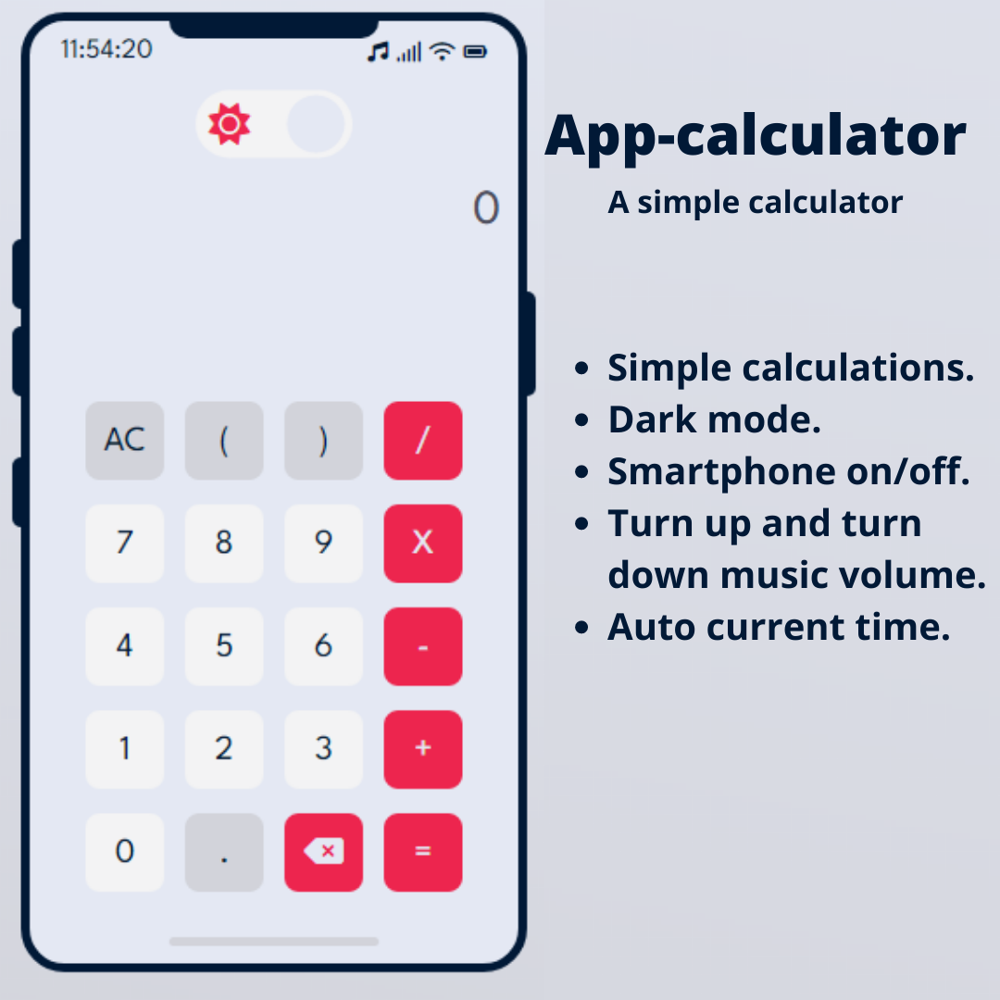

# app-calculator


<div align="center">

### shortcuts 😉

| 1º | 2º |
|----|----|
| [how was the calculation done?](#calc) | [Change Theme ☀️🌙](#theme) |
| [Smartphone on/off](#onOff) | [smartphone volume](#volume) |

</div>

<br>
<br>

|       Light mode☀️         |           Dark mode 🌙   |
|:--------------------------:|:-------------------------:|
|  |  |

<div id="calc">

# how was the calculation done?

### Constructor Function

```js
function Calculator() {
  // Constructor Function
}

const calc = new Calculator();
calc.init();

```
* `function Calculator()` é uma função construtora que servi de molde para criação de novos objetos e é instanciada a parte da variavel chamada `calc`. Dentro dessa função tera os seguintes recursos:
<hr/>

### Variables and Functions

> #### `this.input` and `this.display`
```js
this.input = document.getElementById('input');
this.display = document.getElementById('display');
```
* `this.input` É o input que terá os valores que serão calculados.
* `this.display` É onde será mostrado o resultado do calculo.
<hr/>

> #### `this.init()`
```js
this.init = () => {
  this.checkChar();
  this.buttonClick();
  this.pressEnter();
  this.buttonPress();
}
```
* `this.init` É uma `função de seta` para executar as principais funções.
<hr/>

> #### `this.errorMessage()`
```js
this.errorMessage = (msg) => {
  this.input.value = this.input.value.replace('*', 'X');
  this.input.classList.add('errorMessage');
  this.display.classList.add('errorMessage');
  this.display.innerText = msg;
}
```
* `this.errorMessage()` Serve para mostar mensagens de possuiveis erros, essa função recebe uma propriedade chamada de `msg` que é o texto da mensagem.

<hr/>

> #### `this.checkChar()`
```js
this.checkChar = () => {
  if (this.input.value === '') this.input.value = 0;
  this.input.addEventListener('keyup', e => {
    this.cleanInput();
    this.errorMessage("you can't type here 😃.");
  });
}
```
* `this.checkChar()` O input está desabilitado porém se o usuário tentar habilitar e digitar algo automáticamente o input será limpo e chamarar a função `this.errorMessage` com uma mensagem de erro. Essa função adiciona um evento de `click`.

<hr/>

> #### `this.calc()`
```js
this.calc = () => {
  try {
    this.input.value = this.input.value.replace('X', '*');
    const inputValue = eval(this.input.value);
    this.input.value = this.input.value.replace('*', 'X');

    if (!inputValue) {
      this.errorMessage('Formatting error');
      return
    }
    this.display.innerText = inputValue;
  } catch (error) {
    this.errorMessage('Formatting error');
    return;
  }
}
```
* `this.calc` dentro dessa função estou usando a declaração `try/catch` para calcular e se não conseguir ele mostar algum erro. e essa função `this.calc` serve para pega todos os valores do `this.input` e chama um método `eval()` para calcular. esse método é bastante perigoso, pois além de calcular ele executa códigos Javascript, por exemplo `alert('teste')` , e por isso desabilitei o input de texto.

<hr/>

> #### *this.setValueInput()*
```js
this.setValueInput = (el) => {
    if (this.input.value == 0) this.input.value = '';
    this.input.value += el;
    this.input.focus();
  }
```
* `this.setValueInput` é uma função que irar receber um valor que poderá ser um número ou uma string, e esse valor será adicionado no input.

<hr/>

> #### `this.cleanInput()`
```js
this.cleanInput = () => {
  this.input.value = 0;
  this.display.innerText = '';
}
```
* `this.cleanInput` essa função irar limpar o input quando for chamado.

<hr/>

> #### `this.deleteOne()`
```js
this.deleteOne = () => this.input.value = this.input.value.slice(0, -1);
```
* `this.deleteOne` é uma função que apagar um valor do input usando o método `slice()`

> #### `this.ButtonClick()`
```js
this.buttonClick = () => {
  document.addEventListener('click', e => {
    const el = e.target;
    if (el.classList.contains('btn-num')) this.setValueInput(el.innerText);
    if (el.classList.contains('btn-others')) this.setValueInput(el.innerText);
    if (el.classList.contains('btn-operator')) this.setValueInput(el.innerText);
    if (el.classList.contains('btn-clean')) this.cleanInput();
    if (el.classList.contains('btn-del')) this.deleteOne();
    if (this.display.innerText === 'Formatting error') this.display.innerText = '';
    this.input.classList.remove('errorMessage');
    this.display.classList.remove('errorMessage');
    if (el.classList.contains('btn-equal')) this.calc();
    if (this.input.value === '') this.input.value = 0;
  });
}
```
* `this.ButtonClick` Essa função pega o valor de cada botão e envia para a função `this.setValueInput(value)`.

<hr/>

> #### `this.pressEnter`
```js
this.pressEnter = () => {
  document.addEventListener('keydown', e => {
    if (e.keyCode === 13) return this.calc();
  })
}
```
* `this.pressEnter` essa função adiciona um evento de click para executar o calculo quando a tecla enter for precionada.

> #### `this.buttonPress()`
```js
this.buttonPress = () => {
  document.addEventListener('keydown', e => {
    const keyCode = e.keyCode;
    if (keyCode === 96 || keyCode === 48) this.setValueInput(0);
    if (keyCode === 97 || keyCode === 49) this.setValueInput(1);
    if (keyCode === 98 || keyCode === 50) this.setValueInput(2);
    if (keyCode === 99 || keyCode === 51) this.setValueInput(3);
    if (keyCode === 100 || keyCode === 52) this.setValueInput(4);
    if (keyCode === 101 || keyCode === 53) this.setValueInput(5);
    if (keyCode === 102 || keyCode === 54) this.setValueInput(6);
    if (keyCode === 103 || keyCode === 55) this.setValueInput(7);
    if (keyCode === 104 || keyCode === 56) this.setValueInput(8);
    if (keyCode === 105 || keyCode === 57) this.setValueInput(9);
    if (keyCode === 8) this.deleteOne();
    if (keyCode === 46) this.cleanInput();
    if (keyCode === 107) this.setValueInput('+');
    if (keyCode === 109) this.setValueInput('-');
    if (keyCode === 106) this.setValueInput('*');
    if (keyCode === 111) this.setValueInput('/');
    if (keyCode === 194) this.setValueInput('.');
    if (this.display.innerText === 'Formatting error') this.display.innerText = '';
    if (this.input.value === '') this.input.value = 0;
    this.input.classList.remove('errorMessage');
    this.display.classList.remove('errorMessage');
  });
}
```
* `this.buttonPress` essa função adiciona um evento `keydown` para pegar a tecla que o usuário digitou e verifica se é um número, operador ou um ponto e envia esse valor para o `this.setValueInput()`.

## Change theme.

</div>
